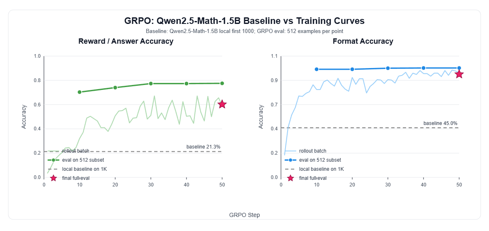
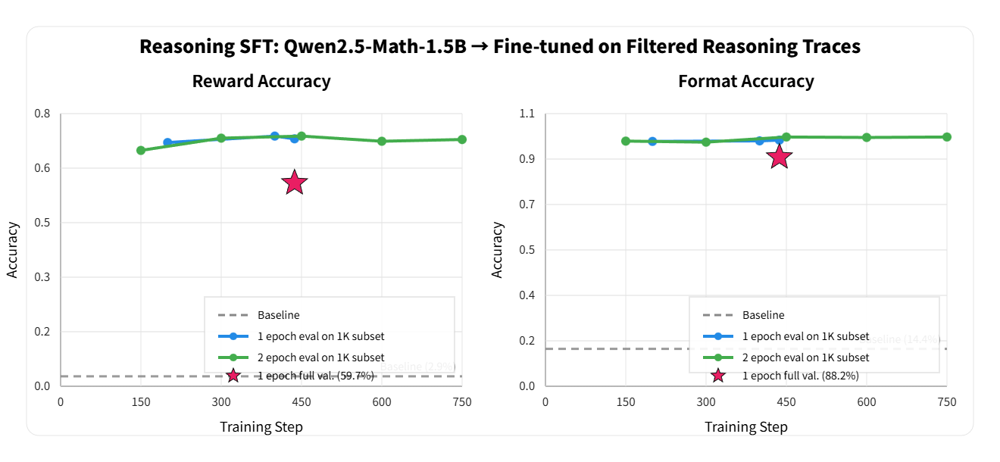

# CS336 Assignment 5 实现记录

这份 README 是给后来者，也是留给笔者期末周后看的（众所周知期末周后人的记忆会重置bushi）。

说来惭愧，这基本也是笔者第一次完整跑这种训练项目：从读作业、补函数、跑单元测试，到本地小样本验证，再到服务器上跑 SFT / GRPO，中间遇到了很多很具体但很折磨的问题：数据集没权限、reward 解析不符合预期、服务器依赖不一致、vLLM 版本差异、系统盘爆掉、结果拉不下来。当然因为经费原因，最终也只用完了英博云送的50元代金券就结束了（https://www.ebtech.com/ 大善人）。  
所以这里我希望能尽量做成一个简明的使用文档，让初学者同志们先知道每个文件夹是干什么的、真正要改的代码在哪里、哪些脚本是后来为了跑实验补上的，然后再去 `task-explaination/` 里的 QA 里看具体命令和排错过程。

原始作业说明：

- [cs336_spring2025_assignment5_alignment.pdf](./cs336_spring2025_assignment5_alignment.pdf)
- [cs336_spring2025_assignment5_supplement_safety_rlhf.pdf](./cs336_spring2025_assignment5_supplement_safety_rlhf.pdf)（配有gpt翻译的中文文档）

## 项目结构

```text
assignment5-alignment-main/
|- README.md
|- pyproject.toml
|- uv.lock
|- cs336_alignment/
|  |- sft.py
|  |- sft-scaffold.py
|  |- grpo.py
|  |- drgrpo_grader.py
|  |- prompts/
|  |  |- r1_zero.prompt
|  |  |- question_only.prompt
|  |  |- alpaca_sft.prompt
|  |  `- zero_shot_system_prompt.prompt
|  `- grpo-scaffold.py
|- scripts/
|  |- math_baseline.py
|  |- run_local_qwen_baseline.py
|  |- train_sft.py
|  |- plot_sft_curves.py
|  |- train_expert_iteration.py
|  |- train_grpo.py
|  |- plot_grpo_baseline_curves.py
|  |- prepare_math12k.py
|  |- run_sft_experiments.sh
|  `- run_expert_iteration_experiments.sh
|- data/
|  |- gsm8k/
|  `- math/
|- tests/
|  |- test_sft.py
|  |- test_grpo.py
|  |- test_data.py
|  |- test_metrics.py
|  `- ...
|- task-explaination/
|  |- 4.2-4.3 sft-tasks.md
|  |- 5 expert_iteration.md
|  |- 7.2 GRPO_implementation.md
|  |- 8 grpo_experiment.md
|  |- QA_in_sft.md
|  `- QA_in_grpo.md
|- sft-outputs/
`- grpo-outputs/
```

### 根目录文件

- `README.md`：当前这份总览文档，后来重写，用来帮助初学者快速理解项目。
- `pyproject.toml` / `uv.lock`：项目依赖配置。原始项目使用 `uv` 管理依赖。
- `cs336_spring2025_assignment5_alignment.pdf`：作业主体说明。（后有中文翻译文档）
- `cs336_spring2025_assignment5_supplement_safety_rlhf.pdf`：可选补充材料。（对llama做微调，这里没有实现）

### `cs336_alignment/`

这是最核心的实现目录，真正被测试和训练脚本调用的函数大多在这里。

- `sft.py`：后来完成的 SFT 组件，对应作业 4.2。主要包含 tokenization、response mask、masked loss、SFT train step 等。
- `sft-scaffold.py`：后来补充的 SFT 组件脚手架，只保留接口和 TODO，方便对照学习；正式实现仍看 `sft.py`。
- `grpo.py`：后来完成的 GRPO 组件，对应作业 7.2 和 8。主要包含 group-normalized reward、policy gradient loss、GRPO clip loss、masked mean、microbatch step 和 train loop。
- `drgrpo_grader.py`：原始项目提供的 reward / grader 逻辑。`r1_zero_reward_fn` 会检查 `<think>` / `<answer>` 格式并判断答案。
- `prompts/`：prompt 模板目录。baseline、SFT eval 和 GRPO rollout 主要用 `r1_zero.prompt`。
- `grpo-scaffold.py`：作为grpo.py的脚手架代码，由于这部分比较复杂，可以直接从这里实现作业中的各个组件，后续真正使用的是 `grpo.py`。

### `scripts/`

这是实验入口目录。`cs336_alignment/` 更像“库代码”，`scripts/` 更像“我现在要跑某个任务”的命令入口。

- `math_baseline.py`：后来补充和修改的 4.1 baseline 评测脚本，支持 Transformers / vLLM。
- `run_local_qwen_baseline.py`：后来新增的本地 baseline wrapper，用本地 Qwen 模型跑前 1000 条和全量验证，方便自己核对博客或外部结果。
- `train_sft.py`：后来实现的 4.3 SFT 训练脚本，支持训练和评估分卡、vLLM eval、checkpoint / summary 输出。
- `plot_sft_curves.py`：后来新增的 SFT 曲线绘图脚本。
- `train_expert_iteration.py`：后来实现的 expert iteration 入口，对应第 5 节。
- `train_grpo.py`：后来实现的 GRPO 训练脚本，对应第 8 节，调用 `cs336_alignment/grpo.py` 中的训练循环。
- `plot_grpo_baseline_curves.py`：后来新增的 GRPO 结果绘图脚本，用 baseline summary 和 GRPO metrics 生成对比图。
- `prepare_math12k.py`：用于准备开源替代数据。
- `run_sft_experiments.sh` / `run_expert_iteration_experiments.sh`：实验命令封装脚本。

### `data/`

本地数据目录。由于没有原始私有 MATH 数据集权限，这里使用替代数据。

- `data/gsm8k/`：最早用于 4.1 baseline 链路测试。
- `data/math/train.jsonl`：GRPO 训练使用的 MATH-like prompt 数据。
- `data/math/val.jsonl`：SFT / GRPO / baseline 评估使用的验证集。
- `data/math/sft_gpt-oss-120b.jsonl`：原始 reasoning SFT 轨迹。
- `data/math/sft_gpt-oss-120b_filtered.jsonl`：过滤后的 SFT 轨迹，4.3 SFT 实验主要使用它。

### `tests/`

单元测试目录。写组件函数时不要直接上服务器训练，先跑测试。

- `test_sft.py`：检查 `sft.py` 里的 SFT 组件。
- `test_grpo.py`：检查 `grpo.py` 里的 GRPO 组件。
- `test_data.py` / `test_metrics.py`：数据和指标相关测试。
- `adapters.py`：原始作业中用于把测试连接到实现函数的适配层。

常用测试：

```bash
.venv/bin/python -m pytest tests/test_sft.py -q
.venv/bin/python -m pytest tests/test_grpo.py -q
```

### `task-explaination/`

这是更详细的学习记录和排错记录目录。具体命令、服务器操作、报错处理、参数调整，主要放在这里。

- `4.2-4.3 sft-tasks.md`：SFT 任务要求整理。
- `5 expert_iteration.md`：expert iteration 任务要求整理。
- `7.2 GRPO_implementation.md`：GRPO 组件实现要求。
- `8 grpo_experiment.md`：GRPO 实验要求。
- `QA_in_sft.md`：SFT 从本地到服务器训练的问答和踩坑。
- `QA_in_grpo.md`：GRPO 实现、训练、结果整理的问答和踩坑。

如果你要复现某个实验，README 只告诉你“去哪里看”；真正一步步命令建议看这里的 QA。

### `sft-outputs/`

SFT 实验结果归档目录，后来从服务器拉回并整理。

里面主要包括：

- SFT eval summary
- SFT 曲线图
- final full eval 结果
- run config / logs

比较重要的结果路径：

```text
sft-outputs/4.3_sft/analysis/sft_report.md
sft-outputs/4.3_sft/analysis/sft_validation_curves.png
sft-outputs/4.3_sft/figures/sft_two_runs_accuracy_curves.svg
sft-outputs/4.3_sft/final_full_eval/results.summary.json
```

### `grpo-outputs/`

GRPO 和本地 baseline 结果归档目录，后来从服务器和本地实验中整理出来。

里面主要包括：

- 本地 Qwen baseline 的 `first1000.summary.json`
- GRPO 训练过程 `metrics.jsonl`
- GRPO full validation summary
- GRPO 对比曲线图

比较重要的结果路径：

```text
grpo-outputs/local_qwen_baseline/first1000.summary.json
grpo-outputs/grpo_50step/metrics.jsonl
grpo-outputs/grpo_50step/analysis/grpo_baseline_curves.svg
grpo-outputs/grpo_50step_tar/offpolicy_50step_fast/final_full_eval.summary.json
```

## 简单结果对比

本项目最后主要跑出了 SFT 和 GRPO 两组结果。由于数据和算力条件都不是原始作业的完整设置，下面的数字更适合作为“本仓库实现是否跑通、训练是否有效”的参考，而不是严格论文式结论。

| 实验 | 评估设置 | reward / answer accuracy | format accuracy |
| --- | --- | ---: | ---: |
| Qwen baseline | `data/math/val.jsonl` 前 1000 条，本地 Transformers | 0.2130 | 0.4500 |
| SFT | validation subset 1000 条，step 437 | 0.7260 | 0.9480 |
| SFT | full validation 5000 条，step 437 | 0.5966 | 0.8824 |
| GRPO | validation subset 512 条，step 50 | 0.7754 | 0.9922 |
| GRPO | full validation 5000 条，最终评估 | 0.6020 | 0.9354 |



一个比较直观的理解：

- baseline 的格式正确率和答案正确率都比较低，说明 zero-shot 下模型经常不能稳定遵守作业需要的 `<think>` / `<answer>` 格式。
- SFT 显著提高了格式正确率和答案正确率，说明 reasoning traces 对模型输出格式和解题能力都有帮助；但 subset eval 高于 full validation，说明小验证子集可能偏乐观。
- GRPO 的 subset eval 曲线提升很快，但 full validation 结果低于 subset，说明短跑 GRPO 确实学到了 reward 偏好的输出方式，但泛化评估仍需要谨慎。
- GRPO 图里的 `rollout batch` 曲线不是 validation accuracy，而是训练时当前模型在采样 batch 上的即时 reward。SFT 没有这条线，因为 SFT 不需要先生成回答再打 reward。

相关图表：

```text
sft-outputs/4.3_sft/analysis/sft_validation_curves.png
grpo-outputs/grpo_50step/analysis/grpo_baseline_curves.svg
```

## 复现建议

建议顺序：

1. 先读 `task-explaination/4.2-4.3 sft-tasks.md` 和 `task-explaination/7.2 GRPO_implementation.md`，理解要写什么。
2. 跑 `tests/test_sft.py` 和 `tests/test_grpo.py`，确认组件函数没坏。
3. 本地用 `scripts/math_baseline.py` 或 `scripts/run_local_qwen_baseline.py` 跑少量样本，确认模型和 reward 链路正常。
4. 服务器上先 smoke test，再跑 SFT / GRPO。
5. 训练结果只拉回 summary、metrics、图表和少量样例，checkpoint 很大，除非必要不要保存。

详细命令和踩坑过程见：

- [task-explaination/QA_in_sft.md](./task-explaination/QA_in_sft.md)
- [task-explaination/QA_in_grpo.md](./task-explaination/QA_in_grpo.md)

## 最后

这是一项很不错的工程作业，从里面能学到很多——数据格式、路径、依赖、显存、磁盘、vLLM、服务器连接、日志和结果管理等等，以及最重要的gpt老师沟通的能力。当然，后面正式做强化学习或者微调还有llama-factory,verl等可以直接调用，但这里手搓的感觉也很不错。
Have fun!
